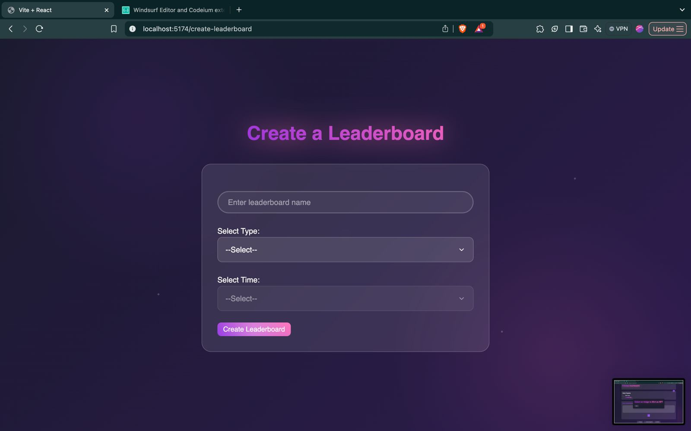

# Decentralized Leaderboard and NFT Staking dApp

A decentralized application (dApp) that enables users to create and participate in blockchain-based leaderboards, stake NFTs for rewards, and engage in real-time communication. This platform leverages blockchain technology for secure and transparent data handling while offering an intuitive user experience.
## Screenshots

<p align="center">
  
  
</p>
<p align="center">
  
  
</p>
<p align="center">
  
  
</p>
<p align="center">
  
  
</p>
<p align="center">
  
  
</p>

## Features

- **Login Options**:  
  - MetaMask authentication  
  - Email-based login  

- **NFT Staking**:  
  - Stake NFTs in leaderboards  
  - Earn rewards for participation  

- **Custom Leaderboards**:  
  - Create new leaderboards  
  - Invite others to participate  
  - Compete for rankings in quiz or staking leaderboards  

- **Leaderboard Interaction**:  
  - View rankings in real-time  
  - Select and interact with specific leaderboards from the main dashboard  

- **Messaging Interface**:  
  - Send and receive messages  
  - Real-time chat with WebSocket support  

- **Notifications**:  
  - Updates for staking, rewards, leaderboard activities, and invites  

## Tech Stack

- **Frontend**:  
  - React.js (UI)  
  - WebSocket for real-time communication  

- **Backend**:  
  - Node.js and Flask servers  
  - Ether.js for blockchain interaction  

- **Blockchain**:  
  - Ethereum for staking and rewards  
  - NFT Smart Contracts for tokenized assets  
  - IPFS for storing metadata  

- **Database**:  
  - Secure storage of user profiles, leaderboard data, and activity logs  

## User Flow

1. **Login**:  
   - Users log in using MetaMask or email.  

2. **Main Dashboard**:  
   - Access multiple leaderboards.  
   - Choose a specific leaderboard for interaction.  

3. **Stake NFTs**:  
   - Stake NFTs in selected leaderboards.  
   - Earn rewards for successful staking.  

4. **Create Leaderboards**:  
   - Set up a new leaderboard.  
   - Invite others to join and compete.  

5. **Leaderboard Interaction**:  
   - View and track rankings in real-time.  

6. **Messaging**:  
   - Communicate with other users via real-time chat.  

## Installation

1. Clone the repository:
   ```bash
   git clone https://github.com/jonathanvineet/tracx.git
   cd tracx
Install dependencies:

```bash
  npm install
```
Start the development server:

```bash
npm run dev
```
Start the backend servers:

Open a separate terminal and start the Node.js server:
```bash
cd src
node server.cjs
```
In another terminal, start the Flask server:
```bash
cd src
python mcq_generator.py

```
License
This project is licensed under the MIT License.

Contact
For any questions or feedback, feel free to reach out:

Email: cvineetjonathan@gmail.com
GitHub: jonathanvineet
